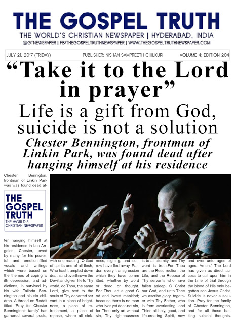
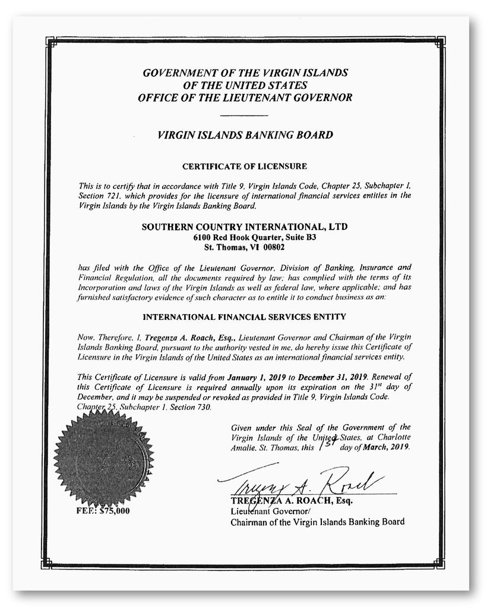
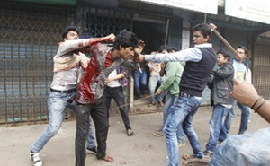
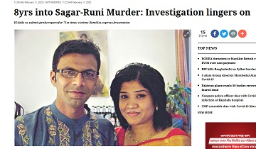

<h1>------------------------Save the world---------------------</h1>
<h2>This is a webpage where we speak about the threats which the whole world is facing.
Down here you will find many contents relating different incidents.Enough of that introduction.
Down there it all begins↓↓</h2>

{-:  :-} 

<h3>Chester Benginton death tragedy</h3>
 Was Chester Bennington's death a conspiracy?
Because he had just bought his family home, and only a half bottle of wine was found, and the death occurred on the exact date of his close friend Chris Cornell's birthday, about whom he may well have known why he might have been murdered, if he was, and wouldn't likely kill himself on Cornell's birthday, if he was merely hit hard by his friend's death … and Cornell had spoken in an interview about how much he realized his son needs him and was very natural emotionally, but also Chester had Clinton Foundation / Haiti connection, because there is a possible Podesta sex crime knowledge, while Chester's official dad was in a police sex crimes unit: there is a good, even handed YouTube video discussion about how Podesta knew his mother and seems to have abused him; Chris even looks uncannily like Podesta, so maybe he was his son. The YouTube video is called, “Chris Cornell and Chester Bennington: What did they know?”, and the thinker's channel is, “Higher Truth”.
(Moreover, Chris had mentioned Paul McCartney's death and replacement in 1966 as a fact, in passing, and probably would have gotten some fans contacting him about what they'd assume was a joke, and he might well have begun afterwards to say no, it's relatively widely known and/or discussed in the music industry, or even begun, behind the scenes, to make ripples about telling). … At the very least, we must say the deaths seem to be linked, and what the likely causes are. But we will likely not get confirmation. RIP both, no matter what.

<h3>Jeffrey Epstein’s Mystery Bank Came Alive After His Death</h3>
Southern Country International received millions of dollars from Mr. Epstein’s estate in December.

<h1>-Forgotten incidents which you don't care anymore-</h1>

